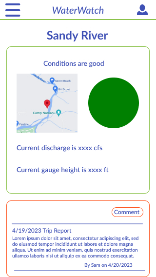

# DriftCast
DriftCast is a mobile-ready application for angler's. So far, DriftCast features three rivers popular in and around Portland, OR.

Using real-time stream gage data from the U.S. Geological Survey API, atmospheric data from the National Weather Service API and knowledge developed from years of experience on the water, DriftCast allows Portland-area anglers to quickly check the conditions on popular streams.


## Technologies Used
- React.js
- TailwindCSS
- Node.js
- Mongoose
- Express.js
- multer
- client-s3
- s3-request-presigner
- path
- dotenv
- axios
- AWS S3
- crypto
- sharp
- @tailwindcss/forms
- jwt-simple

## Installation Instructions
Of course, [DriftCast](https://drift-cast.herokuapp.com/) is hosted and live on heroku.

However, if you'd like to fork the [repository](https://github.com/spbovarnick/drift-cast), you'll need to set up an `.env` file that looks like this:

```
GOOGLE_API_KEY=<YOUR_GOOGLE_API_KEY>
MONGODBURI=<YOUR_MONGODBURI>
BUCKET_NAME=<YOUR_S3_BUCKET_NAME>
BUCKET_REGION=<YOUR_S3_BUCKET_REGION>
S3_ACCESS_KEY=<YOUR_S3_ACCESS_KEY>
S3_SECRET_ACCESS_KEY=<YOUR_S3_SECRET_ACCESS_KEY>
JWT_SECRET_KEY=<YOUR_JWT_SECRET_KEY>
```

The USGS API does not require any special tokens or keys to access. Pretty cool!

## User Stories
- As an angler who works full time, I want to maximize my time on the water and only make a trip if the conditions are right.
- As an angler new to the area, I don't know what optimal river conditions are, so I want an app that tells me.
- As a member of the local angling community, I want to be able to leave comments about the fishing under various conditions.

## Wireframes
The following wireframes represent the mobile interface for the site. Obviously, they're a bit *louder* than the final product.




## Hurdles
The first hurdle this app presented was handling the object returned by my call to the USGS API. While rich with information, the returned JSON object is kind of a mess. Developing the logic to grab the information I needed and check it against hard-coded condition ranges took some doing.

Image upload was the next big hurlde. Multer, the @aws-sdk/s3-request-presigner middleware, S3, and the routing from front- to backend is fairly complicated and required great attention to detail in order to get all those moving parts to work together.

Relatedly, image file size created some performance issues. Fortunately, I was able to resolve that relatively easily by filtering files by size on the frontend, which makes image upload requests super snappy.

## Unsolved Problems
I'd attempted to use [PhotoSwipe](https://photoswipe.com/), but was unable to get it up and running, even using the unofficial [react-photoswipe-gallery](https://github.com/dromru/react-photoswipe-gallery) library. Aside from that particular feature, there are no unsolved problems, only additional features and functionalities I hope to incorporate.

## Next Steps
- Expanding the number of rivers featured on DriftCast
- Expanding user functionality to enable user-to-user inteaction, tagging, replies and messaging